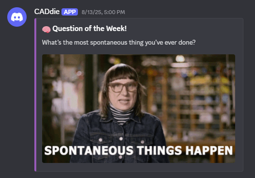
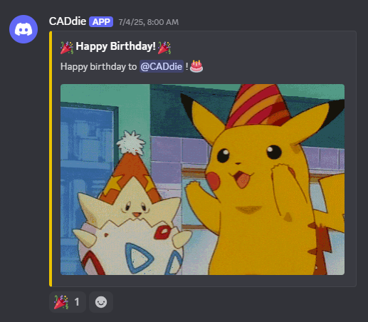
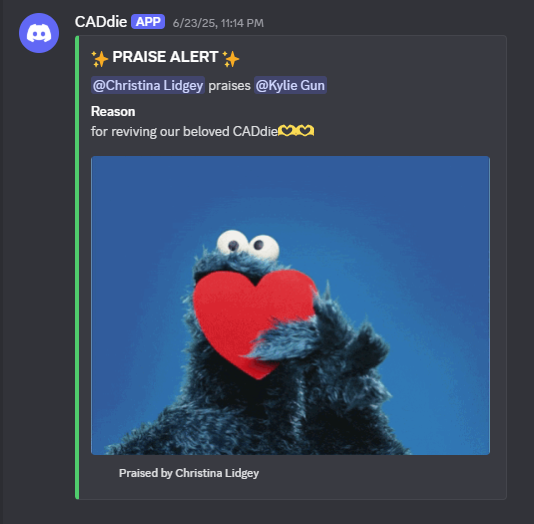

# 🎉 CADdie Discord Bot

**CADdie** is a custom multipurpose Discord bot created for the **McMaster Design League** server. It enhances engagement and community with:

- 🧠 Weekly Questions (QOTW)
- 🎂 Birthday Shoutouts
- 💌 Praise Notes
- More features in the works!

Built using **Python** and the **discord.py** library.


---

## 🧑‍💻 Contributors
### Made with ❤️ by the MDL Software Team

---
## ✨ Features

### 🧠 Question of the Week (QOTW)
- Sends a fun or thoughtful question every **Wednesday at 5:00 PM EST**
- Each question is paired with a unique GIF
- Tracks which question was last sent to avoid repeats
<p align="center">
  
</p>


### 🎂 Birthday Shoutouts
- Automatically sends birthday wishes to members on their special day
- Pulls from a JSON-formatted list of Discord user IDs and birthdates
- Sends messages in a dedicated birthday channel
<p align="center">
  
</p>


### 💌 Praise Command
- Users can give public shoutouts with:  
  `!praise @user [your message here]`
- Praise appears in a designated channel
- Encourages positivity and community appreciation
<p align="center">
  
</p>


## 📁 Project Structure
```txt
caddie-bot/
├── bot.py
├── .env
├── requirements.txt
├── praise/
│ └── praise.py
├── birthday_shoutout/
│ └── birthday_shoutout.py
├── qotw/
│ ├── qotw.py
│ ├── questions.txt
│ ├── qotw_gifs.txt
│ └── qotw_index.txt
└── screenshots/
├── qotw.png
├── birthday.png
└── praise.png
```


---

## 🚀 Setup Instructions

### 1. Clone the Repository

```bash
git clone https://github.com/yourusername/caddie-bot.git
cd caddie-bot
```

### 2. Create and Activate a Virtual Environment
# Windows
```bash
python -m venv venv
.\venv\Scripts\activate
```

# macOS/Linux
```bash
python3 -m venv venv
source venv/bin/activate
```

### 3. Install Dependencies
```bash
pip install -r requirements.txt
```

### 4. Configure Environment Variables
Create a .env file in the root directory:
```ini
DISCORD_TOKEN=your-bot-token
QOTW_CHANNEL_ID=your-qotw-channel-id
BIRTHDAY_CHANNEL_ID=your-birthday-channel-id
PRAISE_CHANNEL_ID=your-praise-channel-id

BIRTHDAYS_JSON=[{"id": "1234567890", "date": "MM-DD"}, {"id": "0987654321", "date": "MM-DD"}]
```

### ⚠️ DO NOT commit your .env file. Add it to .gitignore.

### 5. Run the Bot!
```bash
python bot.py
```
If successful, you should see:
```swift
CADdie#1234 is now running!
```

---
### 🤝 Contributing
Contributions are welcome! Feel free to fork this repo and submit pull requests.
